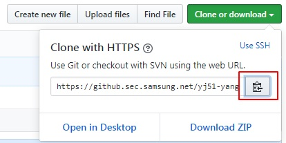
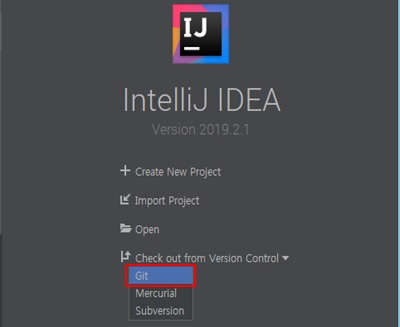
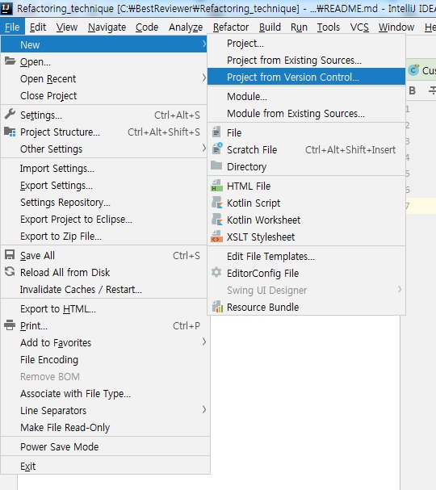
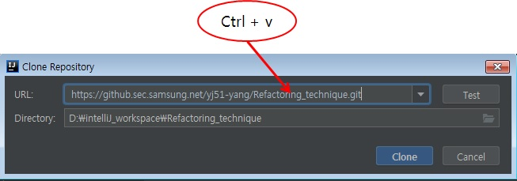
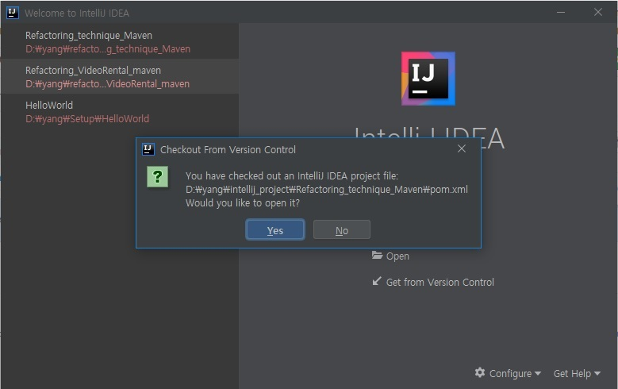
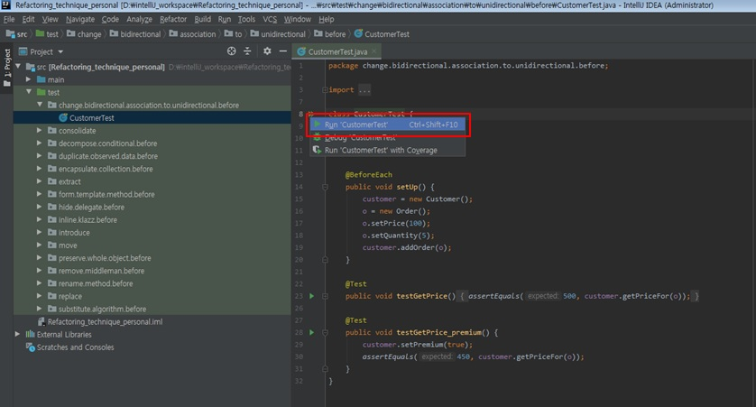
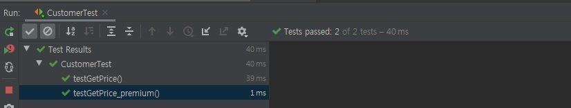

## 코드를 clone 하셔서 실습 준비를 해주세요.  아래 단계를 따라 진행해 주시면 됩니다.

### Copy repository URL

### Run IntelliJ and Choose Git

or

### Clone repository

### Open pom.xml

### Open and Run any test

### Check the test pass

